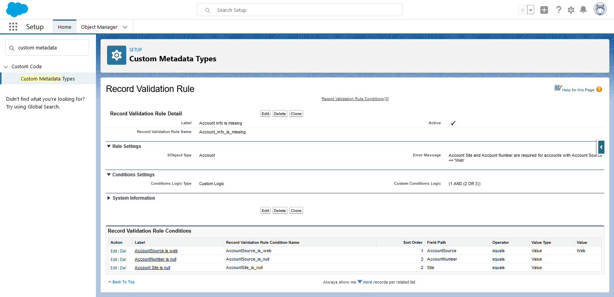
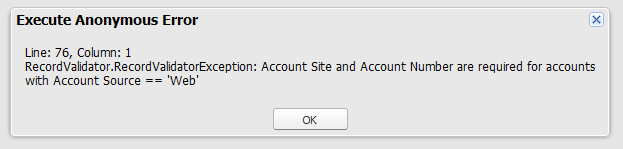

# Apex Validation Rules for Salesforce

[](https://github.com/jongpie/ApexValidationRules/actions/workflows/deploy.yml)
[](https://codecov.io/gh/jongpie/ApexValidationRules)

---

<a href="https://githubsfdeploy.herokuapp.com/?owner=jongpie&repo=ApexValidationRules&ref=main" target="_blank">
    
</a>

An Apex library for validating field values on `SObject` records, using configurable custom metadata types

1. Create validation rules via `RecordValidationRule__mdt` custom metadata type
2. Call `RecordValidator` class in your Apex code or call `FlowRecordValidator` in your Flow to validate the your records pass your validation rules

This is useful in scenarios where standard validation rules cannot be used

1. On-demand validation: standard validation rules only run on during DML statements. Apex Validation Rules can be executed at any point in your code.
2. Apex-only contexts: standard validation rules cannot run in some contexts, such as "after delete" trigger contexts or after workflow field updates/approval processes.

2. Apex-only contexts: standard validation rules cannot run in some contexts, such as "after delete" trigger contexts or after workflow field updates/approval processes

## Examples

### Simple Apex Example: Validating Account Name

As a simple example, you can setup a custom rule to validate that an Account record does not have the name 'Some Account'. This is configured with:

-   Creating 1 rule in `RecordValidationRule__mdt`
-   Creating 1 condition in `RecordValidationRuleCondition__mdt` and relating it to the parent rule
-   Calling the `RecordValidator` class within Apex, which leverages the custom metadata records

This screenshot shows what the rule & condition look like once they've been configured


Once the rule & condition have been setup, you can then call the Apex class to validate the record. In this case, the Apex is using the name 'Some Account', which is not allowed based on how the rule & condition have been setup

```java
    Account someAccount = new Account(Name = 'Some Account');
    new RecordValidator(someAccount).validate();
```

When you run `new RecordValidator(someAccount).validate();`, it will throw an exception to indicate that the Account is not valid based on the configured rule.


If you want to simply see if a record has any validation errors (but you don't want to throw an exception), you can use the `getResults()` method like this:

```java
    Account someAccount = new Account(Name = 'Some Account');
    Boolean shouldThrowAnException = false;
    List<RecordValidator.ValidationRuleResult> results = new RecordValidator(someAccount).validate(shouldThrowAnException);

    // For each returned result, show the result details - in this particular example, there will be only 1 result
    for (RecordValidator.ValidationRuleResult result : results) {
        System.debug('result.hasError==' + result.hasError);
        System.debug('result.errorMessage==' + result.errorMessage);
        System.debug('result.conditions==' + result.conditions);
        System.debug('result.conditionsLogic==' + result.conditionsLogic);
        System.debug('result.conditionsLogicType==' + result.conditionsLogic);
    }
```

### Complex Apex Example: Validating Multiple Fields on Account

You can also setup multiple conditions for a rule, using 1 of 3 types of logic (similar to setting up custom conditions for list views, reports and other standard functionality within Salesforce)

1. AND: all conditions must be met
2. OR: any conditions can be met
3. Custom: you can write your own complex logic, such as `(1 AND (2 OR 3))` - the `RecordValidator` class will automagically parse your conditions based on the sort order you specify for each condition (stored in the field `RecordValidationRuleCondition__mdt.SortOrder__c`)

In this example, custom logic is used to validate that the fields `AccountNumber` and `Site` are populated when `AccountSource` == 'Web'



```java
    Account someAccount = new Account(Name = 'My New Account', Type = 'Web');
    new RecordValidator(someAccount).validate();
```

When you run `new RecordValidator(someAccount).validate();`, it will throw an exception to indicate that the Account is not valid based on the configured rule.



Same thing applies here: you can simply call `getResults()` instead of `validate()` if you want to see the results (instead of throwing an exception).

```java
    Account someAccount = new Account(Name = 'My New Account', Type = 'Web');
    Boolean shouldThrowAnException = false;
    List<RecordValidator.ValidationRuleResult> results = new RecordValidator(someAccount).validate(shouldThrowAnException);

    // For each returned result, show the result details - in this particular example, there will be only 1 result
    for (RecordValidator.ValidationRuleResult result : results) {
        System.debug('result.hasError==' + result.hasError);
        System.debug('result.errorMessage==' + result.errorMessage);
        System.debug('result.conditions==' + result.conditions);
        System.debug('result.conditionsLogic==' + result.conditionsLogic);
        System.debug('result.conditionsLogicType==' + result.conditionsLogic);
    }
```
