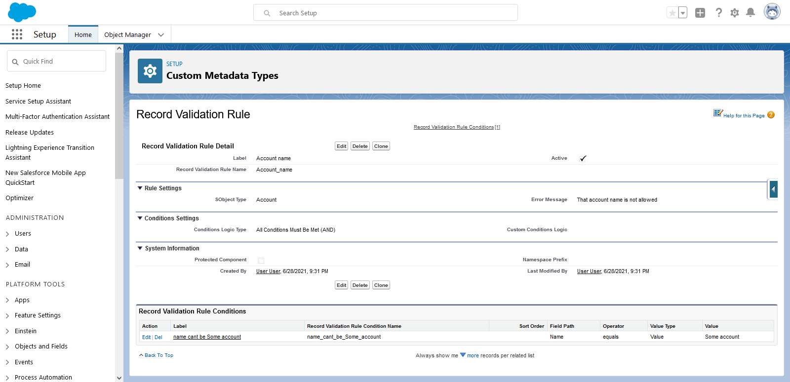
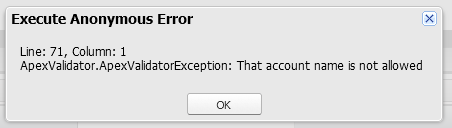

# Apex Validation Rules for Salesforce

<a href="https://githubsfdeploy.herokuapp.com/?owner=jongpie&repo=ApexValidationRules&ref=main" target="_blank">
    
</a>

An Apex library for making code-based validations configurable via custom metadata types

1. Create validation rules via ApexValidationRule\_\_mdt custom metadata type
2. Call ApexValidator class in your trigger handler or class to validate the your records pass your validation rules

This is useful in scenarios where standard validation rules cannot be used

1. On-demand validation: standard validation rules only run on upserted records. Apex Validation Rules can be executed at any point in your code.
2. Apex-only contexts: standard validation rules cannot run in some contexts, such as "after delete" trigger contexts or after workflow field updates/approval processes

## Examples

### Simple Example: Validating Account Name



```java
    Account someAccount = new Account(Name = 'Some Account');
    new ApexValidator(someAccount).validate();
```


